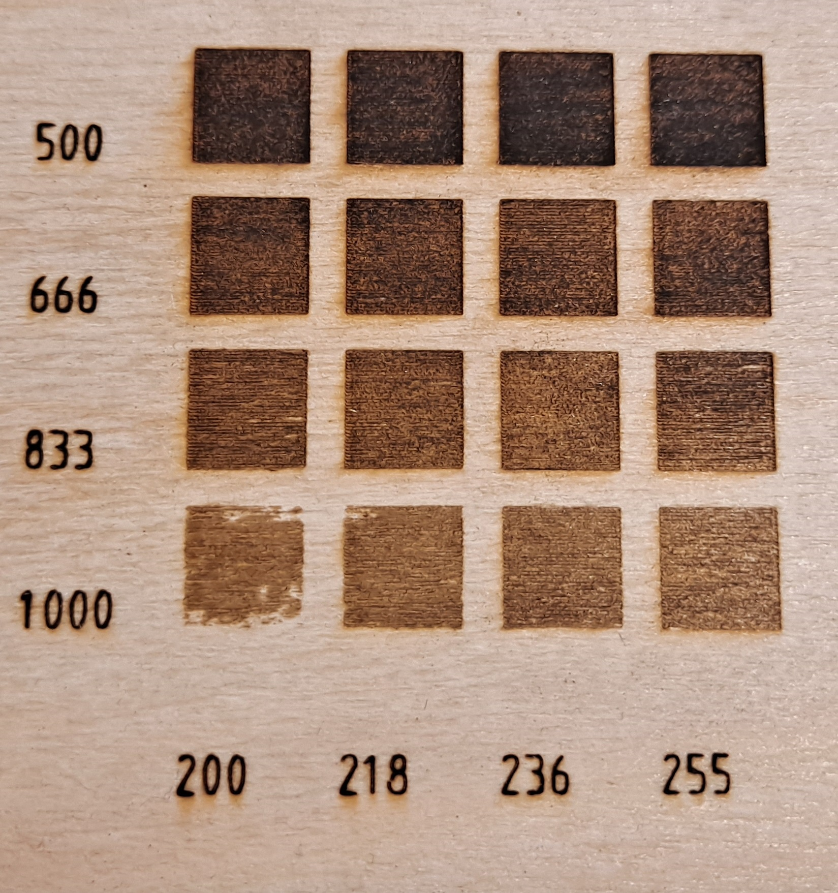
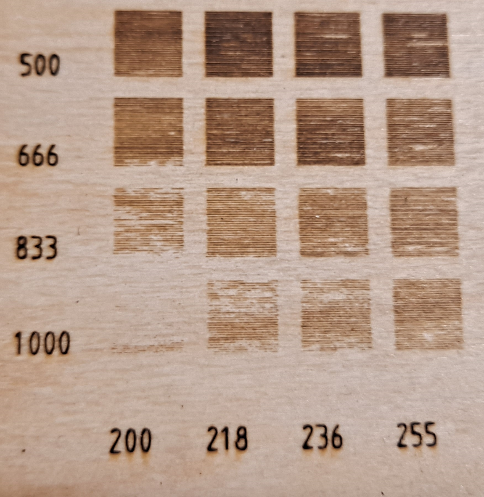
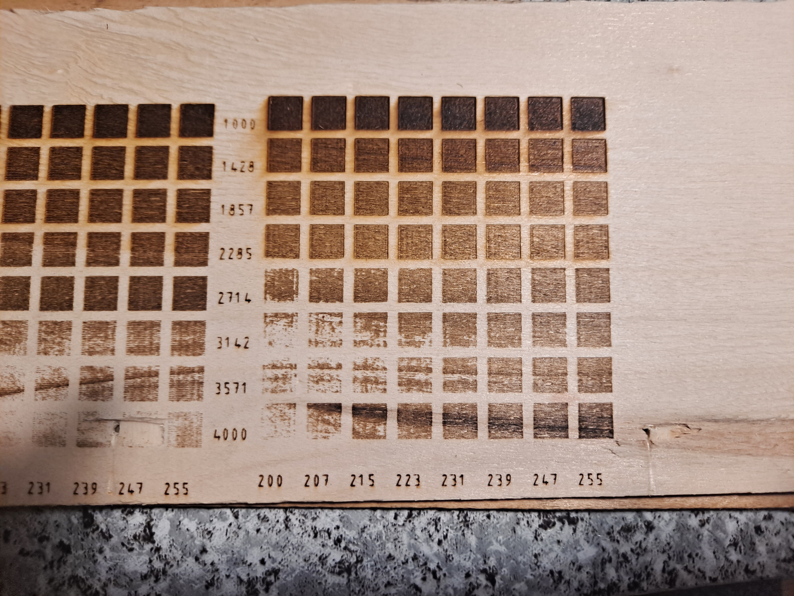
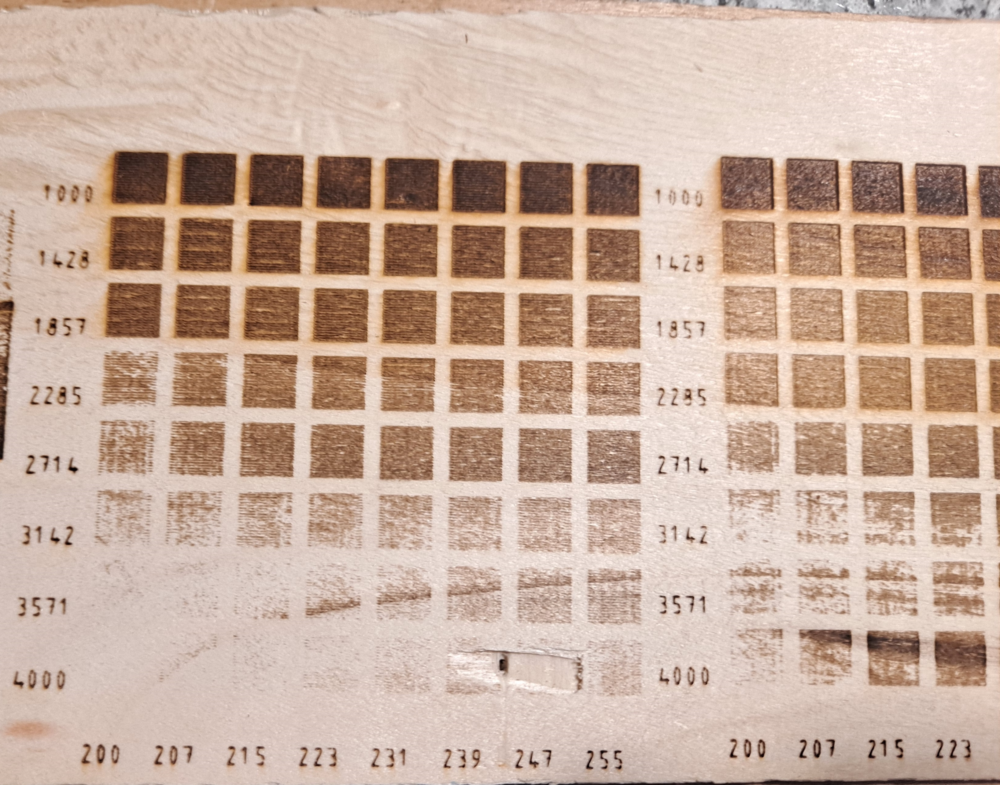
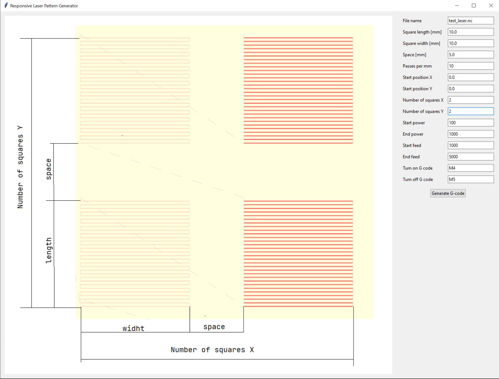
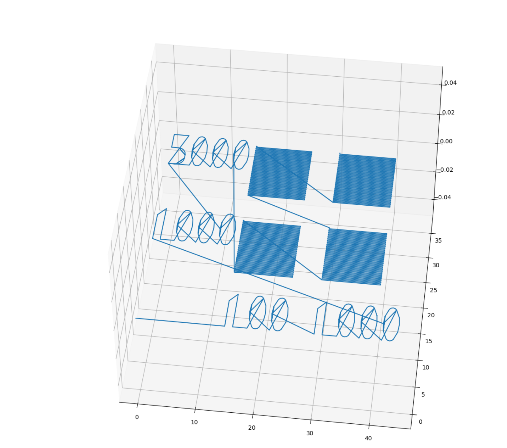

# Laser Pattern Generator

## Overview

The Laser Pattern Generator is a desktop application built using Python and Tkinter. This application allows users to generate G-code patterns for laser engraving machines. Users can input various parameters, such as the dimensions of the pattern, the number of passes, power settings, and feed rates. The application provides a graphical user interface (GUI) to facilitate easy configuration and visualization of the laser engraving patterns.

## Features

- **Responsive GUI**: User-friendly interface that adapts to different screen sizes.
- **Parameter Input**: Allows users to input laser pattern parameters like size, power, speed, and more.
- **G-code Generation**: Automatically generates G-code for the specified pattern.
- **Visualization**: Displays an image alongside the input fields for guidance.
- **Modular Design**: Built with modular components for easy maintenance and updates.

## Installation

### Prerequisites

- Python 3.7 or higher
- Required Python packages: `tkinter`, `numpy`, `matplotlib`

### Steps

1. Clone the repository:

    ```bash
    git clone https://github.com/yourusername/laser-pattern-generator.git
    ```

2. Navigate to the project directory:

    ```bash
    cd laser-pattern-generator
    ```

3. Install the required packages:

    ```bash
    pip install -r requirements.txt
    ```

4. Make sure the image file `instruction.png` is in the `img` directory.

5. Run the application:

    ```bash
    python main.py
    ```

## Usage

1. Launch the application by running the `main.py` file.
2. Enter the desired parameters in the input fields:
    - **File name**: Name of the output G-code file.
    - **Square length/width**: Dimensions of each square in the pattern.
    - **Space**: Space between each square.
    - **Passes per mm**: Number of laser passes per millimeter.
    - **Start Position X/Y**: Starting coordinates for the pattern.
    - **Number of Squares X/Y**: Number of squares in the X and Y directions.
    - **Start/End Power**: Power settings for the laser.
    - **Start/End Feed**: Feed rate settings for the laser.
    - **Turn on/off G-code**: Commands to turn the laser on and off.
3. Click the "Generate G-code" button to create the pattern.
4. The application will display a success message upon generating the G-code.

### Graphics





